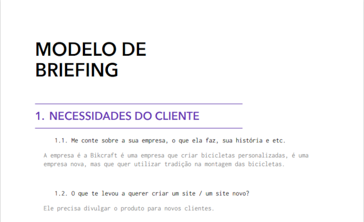
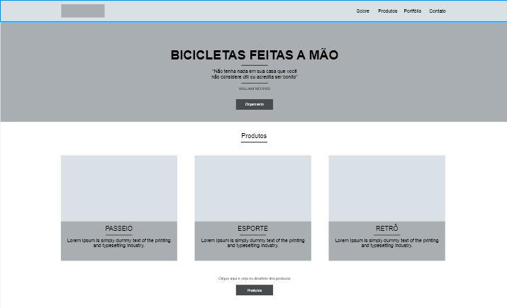
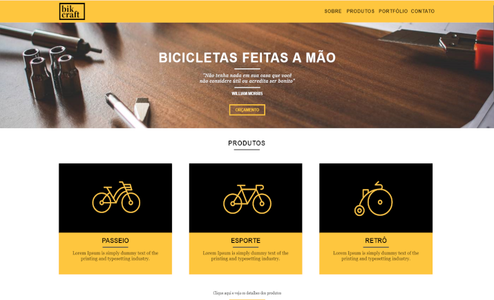

# Bikcraft

O projeto **Bikcraft** é uma projeto de extensão de portfólio! desenvolvido usando as três tecnologias básicas da internet. O HTML, CSS e Javascript. Bikcraft é uma empresa fictícia que cria bicicletas personalizadas, é uma empresa nova, mas que quer utilizar tradição na montagem das bicicletas!

## [Acesse o Bikcraft🚴!](https://bikcraft-three.vercel.app/)

***
## Processo de desenvolvimento

- Brieffing  
Processo de coleta de informação da marca/empresa. Como exemplo necessidades do cliente, história da empresa e os objetivos do site.  

- Wireframe  
Desenvolvimento do esqueleto do website feito em programas de prototipagem(Adobe XD).  

- Design  
Estilizando o wireframe ainda na ferramenta Adobe XD.  

- Codificação  

Chegamos na melhor parte, aqui destaco as principais técnicas usadas no desenvolvimento.  

  💠 Propriedade float para criação dos grids ( futuramente pretendo implementar CSS grid layout e/ou CSS Flexbox ).  
  💠  Adicionando Slider com Javascript na página de portfólio. Usei um plugin js simples disponível [aqui](https://github.com/origamid/simple-slide)  
  💠  Adicionando animações em todas as páginas usando Javascript puro. usei como base um plugin já existente feito pela Origamid, [Clique aqui](https://github.com/origamid/simple-anime) para ver o plugin.  
  💠  **(Ainda não implementado)** Solução de envio de formulário usando NodeJS  
  💠  Aplicando boas práticas de SEO com [Open Graph protocol](https://ogp.me/)🌐
 